<!-- PROJECT SHIELDS -->
<!--
*** I'm using markdown "reference style" links for readability.
*** Reference links are enclosed in brackets [ ] instead of parentheses ( ).
*** See the bottom of this document for the declaration of the reference variables
*** for contributors-url, forks-url, etc. This is an optional, concise syntax you may use.
*** https://www.markdownguide.org/basic-syntax/#reference-style-links
-->

[![LinkedIn][linkedin-shield]][linkedin-url]

<!-- PROJECT LOGO -->
 

    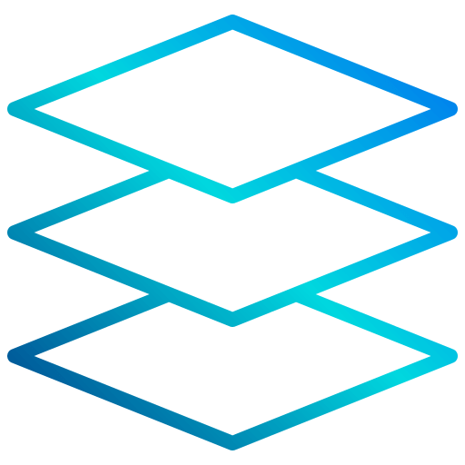

  <h3 align="center">AutoMagic Developer Docker Compose Stack</h3>

<!-- TABLE OF CONTENTS -->

  
Table of Contents

  <ol>
    <li><a href="#about-the-project">About The Project</a></li>
    <li><a href="#screenshots">Screenshots</a></li>
    <li><a href="#preview-video">Preview Video</a></li>
    <li><a href="#contact">Contact</a></li>
  </ol> 

<!-- ABOUT THE PROJECT -->
## About The Project

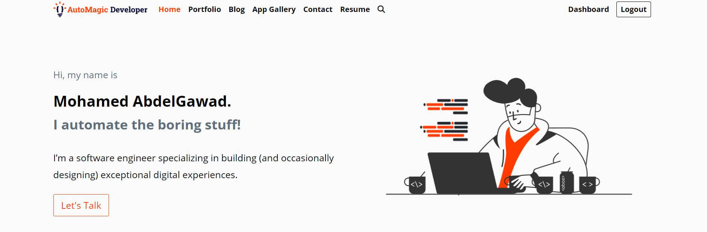

* Project Name: AutoMagic Developer Docker Compose Stack
* Version: v1.0.0
* Organization Department: Technology

### Description

This project is a Django web application, serving as a personal portfolio 
hosted on the domain "automagicdeveloper.com" 
The application is designed to showcase the developer's work and accomplishments. 

It consists of several distinct apps:

**Portfolio:** Showcases the developer's projects, skills, and professional 
achievements.

**Blog:** The blog app allows the developer to share their thoughts, experiences, 
and insights with the audience.

**App Gallery:** A gallery of developed applications with a beautiful slider.

**Insights Dashboard:** A dashboard that analyze the data of published project on the website.

**Contact:** A contact application with a contact form protected with reCAPTCHA.

**Admin Dashboard:** Features a comprehensive admin dashboard 
that provides valuable insights and information, including:
- Website traffic data retrieved from Google Analytics.
- Server utilization data from a separate System Monitor app running in a 
separate container.
- Cloud account billing information, specifically from DigitalOcean.

To ensure smooth functioning and scalability, the project is containerized 
using Docker. It consists of three containers:

**Django App Container:** This container houses the Django web application, 
responsible for handling user interactions and rendering the web pages.

**Postgres Database Container:** The Postgres database container stores 
application data securely.

**System Monitor Crontab Script Container:** This container runs a crontab 
script responsible for monitoring the server and gathering system 
utilization data.

(<a href="#readme-top">back to top</a>)

### Built With

This project was developed using the following tech stacks:

* Python (Django Backend Framework)
* HTML
* CSS
* JavaScript

(<a href="#readme-top">back to top</a>)

<!-- Screenshots -->
## Screenshots

#### Admin Dashboard
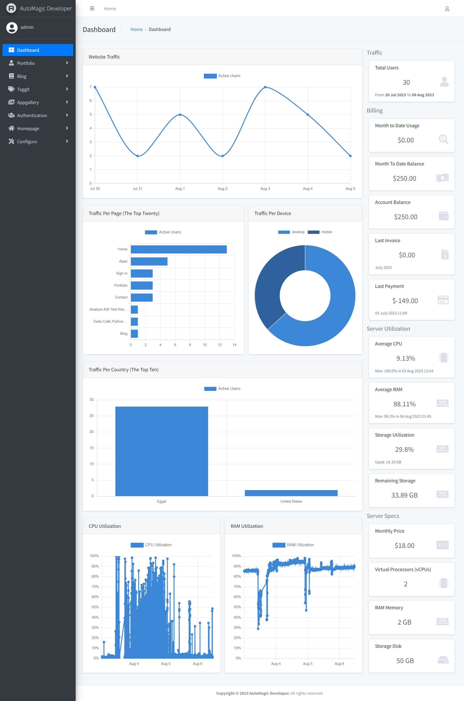

#### Insights Dashboard
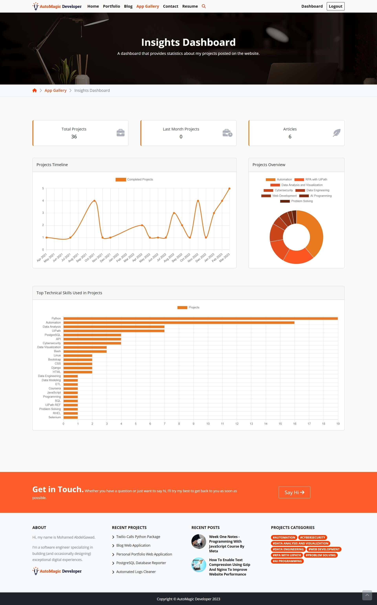

#### Homepage
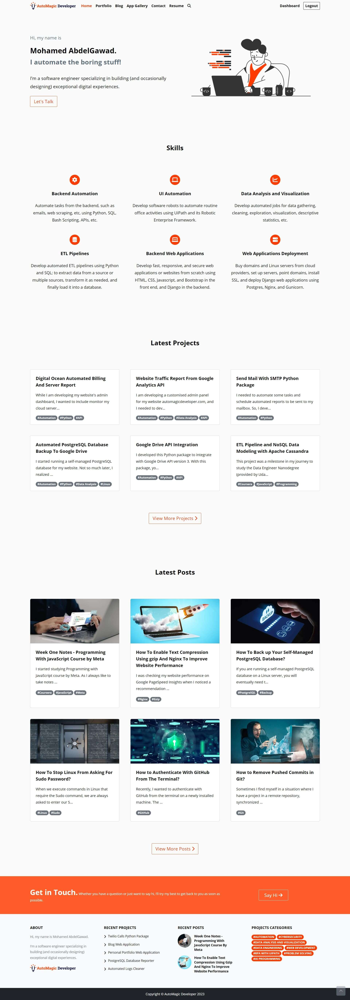

#### App Gallery
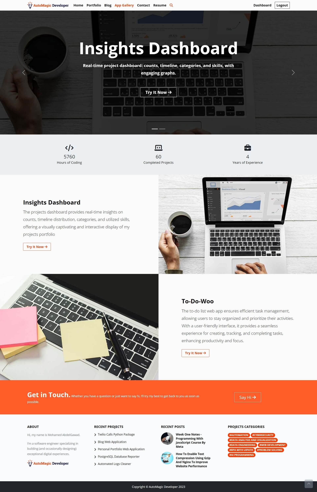

#### Portfolio List
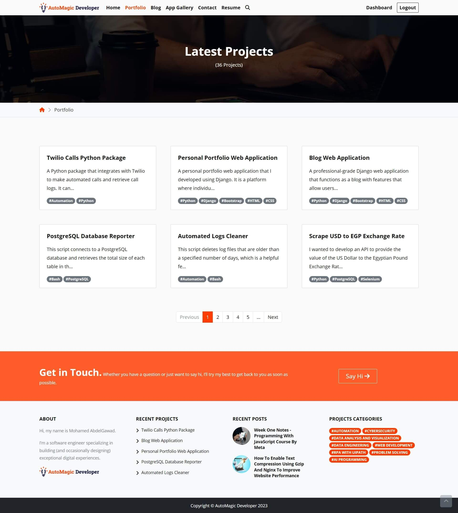

#### Portfolio Project
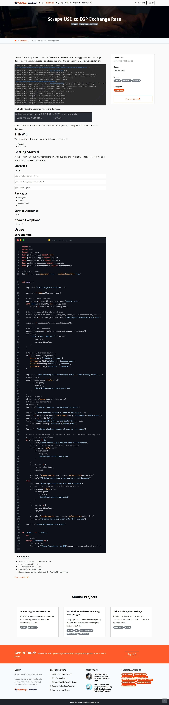

#### Blog List
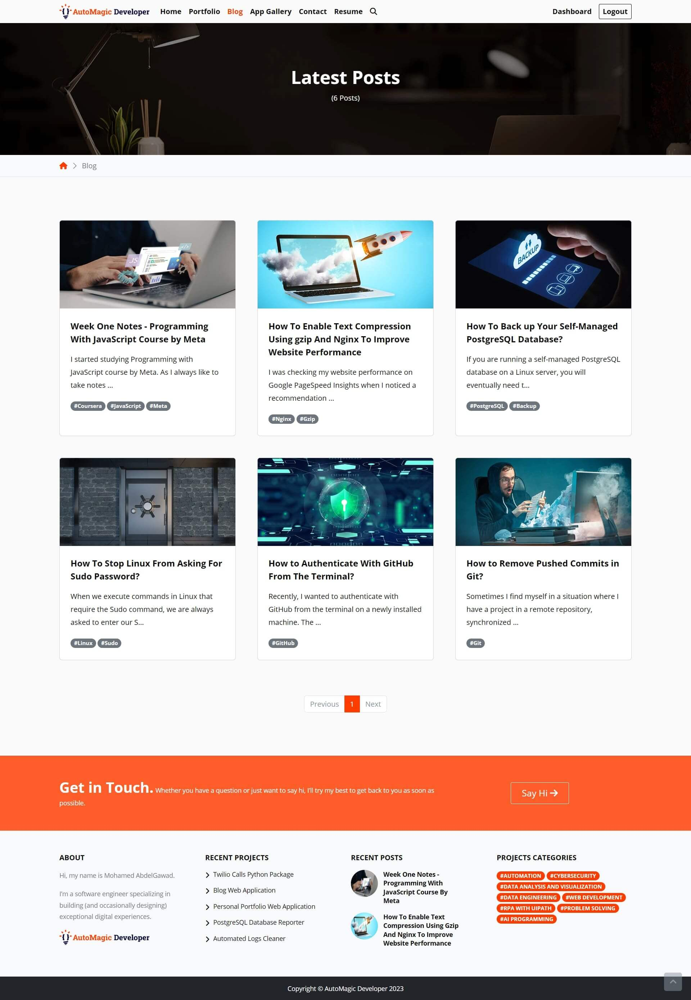

#### Blog Post
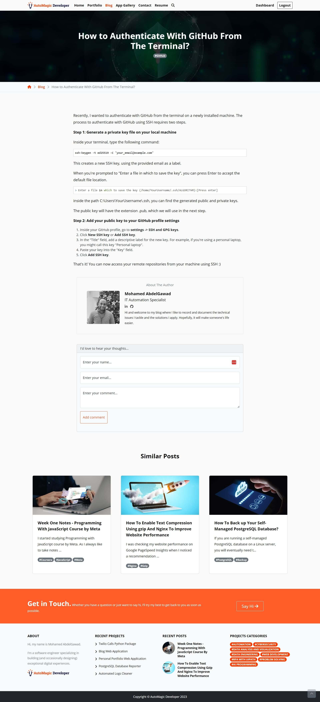

#### Contact
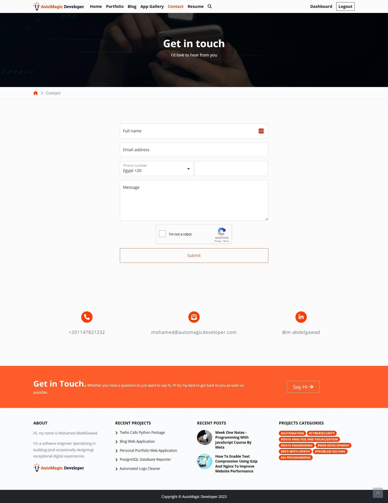

#### Login / Register
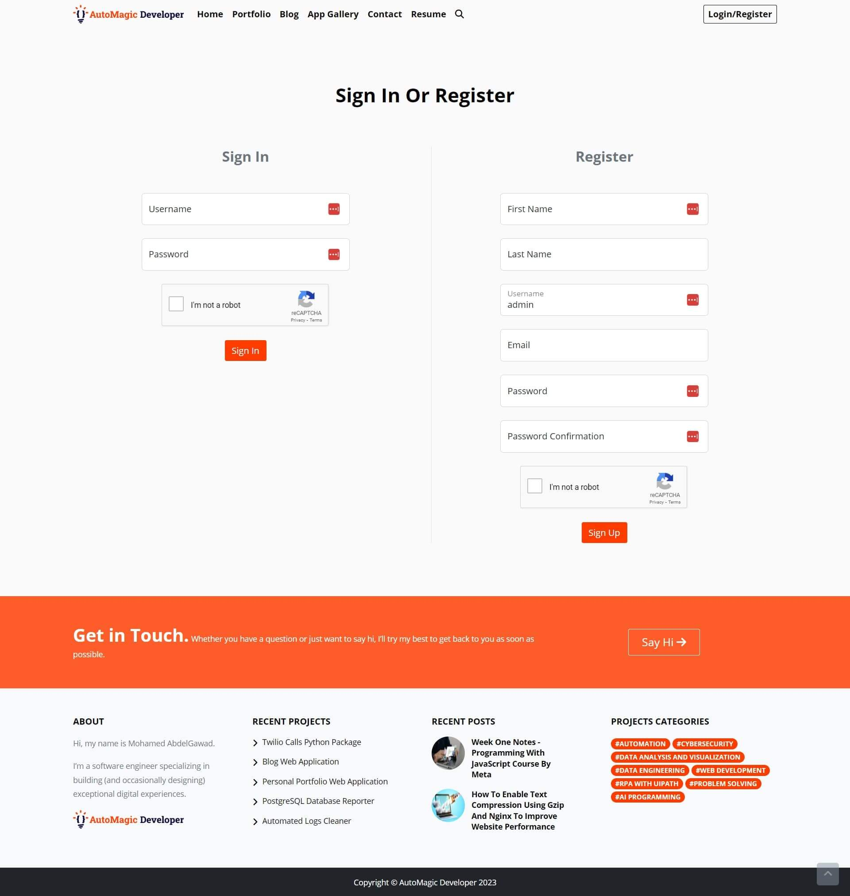

(<a href="#readme-top">back to top</a>)

<!-- Preview Video -->
## Preview Video
[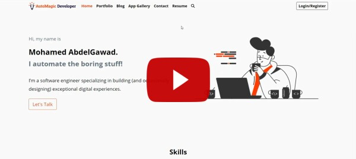](https://youtu.be/39FHj4iAQSA)

(<a href="#readme-top">back to top</a>)

<!-- CONTACT -->
## Contact

Mohamed AbdelGawad Ibrahim - [@m-abdelgawad](https://www.linkedin.com/in/m-abdelgawad/) - <a href="tel:+201069052620">+201069052620</a> - muhammadabdelgawwad@gmail.com

GitHub Profile Link: [https://github.com/m-abdelgawad](https://github.com/m-abdelgawad)

(<a href="#readme-top">back to top</a>)

<!-- MARKDOWN LINKS & IMAGES -->
<!-- https://www.markdownguide.org/basic-syntax/#reference-style-links -->
[linkedin-shield]: https://img.shields.io/badge/-LinkedIn-black.svg?style=for-the-badge&logo=linkedin&colorB=555
[linkedin-url]: https://www.linkedin.com/in/m-abdelgawad/
